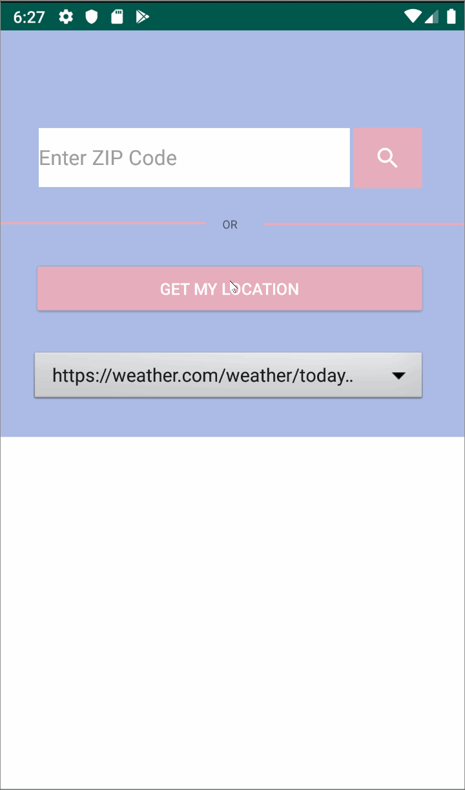

# weatherapp1
Weatherapp1 is an android mobile application that plays with webviews, specifically ones with URLs directing the user to webpages informing
the user of the weather. The rendering of these webviews is dependent upon the user input, in this case their Zip Code to view their local 
weather.

### Portrait View of Weatherapp1 
 

## License

    Copyright [2019] [Luis Gualpa]

    Licensed under the Apache License, Version 2.0 (the "License");
    you may not use this file except in compliance with the License.
    You may obtain a copy of the License at

        http://www.apache.org/licenses/LICENSE-2.0

    Unless required by applicable law or agreed to in writing, software
    distributed under the License is distributed on an "AS IS" BASIS,
    WITHOUT WARRANTIES OR CONDITIONS OF ANY KIND, either express or implied.
    See the License for the specific language governing permissions and
    limitations under the License.
